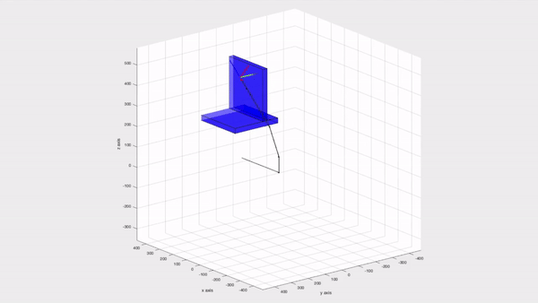

# Artificial Potential Field Projects
* [Artificial Potential Field](#artificial-potential-field)

## Artificial Potential Field
The artificial Potential Field makes every joint move from the high potential positions to the low potential positions 
The obstacles are seen as the high potential area which means joint could not approach to the area, and therefore achieve obstacle avoidance  

<!---->

## USE

## Technologies
Matlab

## Reading Resource
