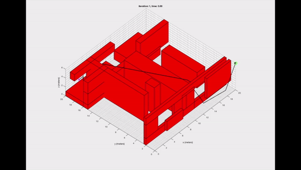

# MAZE Flying Projects
* [A*/DIJKSTRA](#A*/DIJKSTRA)
* [Control](#control-method)

## A*/DIJKSTRA
:triangular_ruler:
The program simulates the flight in the maze  
The destination and source can be set arbitrarily and the program uses either Dijkstra to explore the maze and find the shortest path, or uses the heuristic algorithm A* to have better runtime 

## Control Method
The control method is the snap control to achieve constant speed 

:round_pushpin: Position 

:airplane: Velocity 

## USE

## Technologies
Matlab

## Reading Resource
